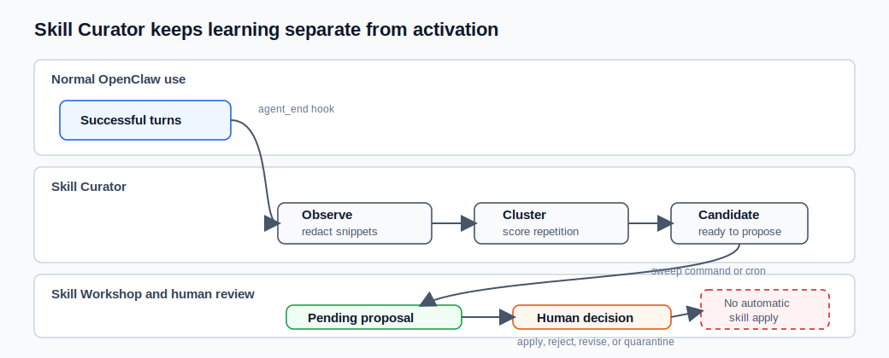

# Skill Curator

Skill Curator is a passive learning plugin for OpenClaw.

It watches successful agent conversations, detects tasks that keep coming back, and suggests them as reusable skill candidates. In practice, it helps OpenClaw notice patterns such as "the user often asks me to check Proxmox backups" and turn that repeated workflow into a pending Skill Workshop proposal.

The goal is not to let the agent create or enable skills on its own. The plugin learns from repetition, prepares a candidate, and leaves the final decision to a human.

## The short version

Skill Curator answers one question:

> "Are we doing the same successful workflow often enough that it deserves a reusable skill?"

Think of it as a pseudo-learning loop, similar in spirit to Hermes-style procedural memory. It is not model training, fine-tuning, or autonomous self-improvement. The plugin records repeated patterns, turns them into evidence-backed candidates, and asks Skill Workshop plus a human reviewer to decide what becomes durable.

It does not write directly into your live skills. It only detects repeated workflows and, when asked, creates a pending Skill Workshop proposal.



## What is Skill Workshop?

Skill Workshop is OpenClaw's review area for reusable skills.

A Skill Workshop proposal is a draft skill waiting for a human decision. You can inspect it, revise it, apply it, reject it, or quarantine it. Until someone explicitly applies a proposal, it is not an active skill.

Skill Curator uses Skill Workshop as a safety gate:

- Skill Curator detects repeated successful work;
- Skill Curator can create a pending proposal;
- Skill Workshop holds that proposal for review;
- a human decides whether it becomes a real skill.

That separation is intentional. The plugin can learn and suggest, but it does not grant itself new abilities.

## Workflow at a glance

1. You use OpenClaw normally.
2. Skill Curator observes successful procedural turns and redacts sensitive-looking data.
3. Similar observations are grouped into candidates.
4. A candidate becomes `ready` when it repeats enough across sessions.
5. `openclaw skill-curator sweep` can create a pending Skill Workshop proposal.
6. A human reviews the proposal in Skill Workshop.
7. Only explicit approval applies the skill.

## What it does

Skill Curator turns repeated successful work into reviewable skill proposals:

- it observes normal OpenClaw agent turns after they finish successfully;
- it stores redacted snippets of procedural requests and outcomes;
- it clusters similar observations across sessions;
- it scores repeated workflows by confidence;
- it reports candidates that look stable enough to become skills;
- optionally, a daily cron can create pending Skill Workshop proposals for ready candidates.

## What it does not do

Skill Curator deliberately separates learning from activation:

- observations are redacted snippets from successful procedural turns;
- candidates are clustered observations with stable-ish IDs and confidence scores;
- reviews record lifecycle decisions: `observed`, `proposed`, `approved`, `rejected`, `rolled_back`;
- promotion into a real skill stays outside the observer and should go through the normal Skill Workshop flow.

It never applies, installs, or enables a generated skill automatically.

## CLI

```bash
openclaw skill-curator status
openclaw skill-curator report --ready-only
openclaw skill-curator sweep --dry-run --json
openclaw skill-curator sweep --json
openclaw skill-curator review skill-0123456789abcdef proposed --note "Candidate for Skill Workshop"
openclaw skill-curator install-cron --json
openclaw skill-curator uninstall-cron --json
```

## Manual review flow

Use Skill Curator as a detector, not as an automatic installer.

1. Let normal agent turns accumulate observations.
2. List candidates:

```bash
openclaw skill-curator report --json
openclaw skill-curator report --ready-only --json
```

3. When a candidate is `ready` and `recommendation` is `propose`, inspect its evidence.
4. Create pending Skill Workshop proposals from eligible candidates:

```bash
openclaw skill-curator sweep --dry-run --json
openclaw skill-curator sweep --json
```

5. Or, if you create a proposal manually, mark the candidate lifecycle state:

```bash
openclaw skill-curator review skill-0123456789abcdef proposed \
  --note "Converted to Skill Workshop proposal <proposal-id>" \
  --author main
```

6. Apply, reject, or quarantine the Skill Workshop proposal only after explicit human approval.

The expected lifecycle is:

```text
observed -> proposed -> approved|rejected|rolled_back
```

`approved` means the candidate has already been handled outside Skill Curator. It does not install or activate a skill by itself.

## Proposal sweep cron

The observer hook captures signals automatically, but reports and Skill Workshop proposals are not created unless something checks the report.

Install the optional daily sweep:

```bash
openclaw skill-curator install-cron --json
```

Defaults:

- schedule: `20 4 * * *`
- timezone: `Europe/Paris`
- agent: `main`
- session target: `isolated`
- delivery: none

The installed cron runs:

```bash
openclaw skill-curator sweep --json
```

The native sweep command:

- reads ready candidates from the report pipeline;
- ignores candidates already `proposed`, `approved`, or `rejected`;
- skips candidates when an equivalent pending Skill Workshop proposal already exists;
- creates compact pending Skill Workshop proposals for new `ready` candidates with `recommendation: propose`;
- marks converted candidates as `proposed`;
- never applies proposals automatically.

The installer is idempotent. It detects existing jobs with the marker `managed-by=skill-curator.proposal-sweep`.

Dry-run:

```bash
openclaw skill-curator install-cron --dry-run --json
```

Update an existing managed sweep after changing defaults:

```bash
openclaw skill-curator install-cron --refresh-existing --json
```

Remove managed sweep jobs:

```bash
openclaw skill-curator uninstall-cron --json
```

## Install

From ClawHub:

```bash
openclaw plugins install clawhub:creanet/openclaw-skill-curator
openclaw plugins inspect skill-curator --runtime --json
```

From a local checkout:

```bash
openclaw plugins install ./plugins/skill-curator --link
openclaw plugins inspect skill-curator --runtime --json
```

After enabling or updating the plugin, restart or reload the Gateway so the startup hook is loaded by the running Gateway.

The install command only installs the OpenClaw plugin and its CLI commands. It does not install a separate Codex/OpenClaw skill, does not create the daily cron job, and does not apply generated skills.

To enable the optional daily proposal sweep, run:

```bash
openclaw skill-curator install-cron --json
```

The cron runs `openclaw skill-curator sweep --json`, which can create pending Skill Workshop proposals. Those proposals still require explicit human review before they are applied.

## Publish

The ClawHub package is published under the CREANET owner:

```text
creanet/openclaw-skill-curator
```

Support is provided on a best-effort basis. Issues and pull requests are welcome, but there is no guaranteed response time or maintenance commitment.

Validate locally:

```bash
npm test
openclaw plugins inspect skill-curator --runtime --json
openclaw skill-curator install-cron --dry-run --json
```

Publish with ClawHub:

```bash
clawhub login
clawhub package publish . \
  --family code-plugin \
  --owner creanet \
  --name openclaw-skill-curator \
  --display-name "OpenClaw Skill Curator" \
  --version 0.3.1 \
  --source-repo creanet-64/openclaw-skill-curator \
  --source-ref v0.3.1 \
  --dry-run

clawhub package publish . \
  --family code-plugin \
  --owner creanet \
  --name openclaw-skill-curator \
  --display-name "OpenClaw Skill Curator" \
  --version 0.3.1 \
  --source-repo creanet-64/openclaw-skill-curator \
  --source-ref v0.3.1
```

Users can then install with:

```bash
openclaw plugins install clawhub:creanet/openclaw-skill-curator
```

## End-to-end test

Use a neutral demo workflow when testing the plugin. Do not rely on local scripts, private infrastructure, or machine-specific examples.

Example prompt:

```text
TEST_SKILL_CURATOR_DEMO: Check this demo release checklist and report missing items, risks, and next action: docs ready, tests pending, rollback plan missing.
```

### Quick detector test

Use this when you only want to confirm that observation capture and clustering work.

1. Send the example prompt once in a normal OpenClaw chat.
2. Run the report with relaxed thresholds:

```bash
openclaw skill-curator report \
  --ready-only \
  --min-occurrences 1 \
  --min-sessions 1 \
  --min-confidence 0.3 \
  --json
```

Expected result:

- the report is not empty;
- a candidate references the demo release checklist request;
- the candidate has `recommendation: "propose"` when it passes the relaxed thresholds.

These relaxed thresholds are for testing only. They are intentionally noisier than the production defaults.

### Full readiness test

Use this when you want to test the real readiness behavior.

1. Open three separate OpenClaw sessions.
2. In each session, send the same demo prompt or a very close variation.
3. Run:

```bash
openclaw skill-curator report --ready-only --json
```

Expected result:

- the report contains one ready candidate for the demo release checklist workflow;
- the candidate shows at least three observations;
- the candidate shows at least two distinct sessions;
- the candidate status is `observed`;
- the candidate recommendation is `propose`.

If the report is empty, verify that the prompts were sent in distinct OpenClaw sessions. A `/reset` may clear chat context while keeping the same `sessionKey`, so it may still count as one session.

## Confidence

The report score combines repeat count, distinct sessions, explicit corrections, day spread, and tool usage. A candidate is `ready` only when it passes the configured minimum occurrence/session thresholds and `minConfidence`.

Default readiness thresholds:

- `minOccurrences`: 3
- `minSessions`: 2
- `minConfidence`: 0.7
- `similarityThreshold`: 0.5

For local testing inside a single session, lower the session threshold explicitly:

```bash
openclaw skill-curator report --ready-only --min-sessions 1 --min-confidence 0.5 --json
```

Do not use those relaxed thresholds as the default unless noisy candidate generation is acceptable.

## Session behavior

`minSessions` counts distinct OpenClaw `sessionKey` values. A `/reset` can clear or compact conversation context while keeping the same `sessionKey`; it will still count as the same session.

To test multi-session readiness, use a genuinely new chat/session or another channel that produces a different `sessionKey`. Confirm the active key from the UI `/status` output or the OpenClaw `session_status` / `sessions_list` tools.

## Safety and filtering

Captured observations are redacted before storage. Heartbeat and memory-flush messages are ignored before candidate generation and by the SQLite insert trigger. Keep promotion decisions in Skill Workshop so the human can inspect the proposed procedure before anything becomes durable runtime behavior.
